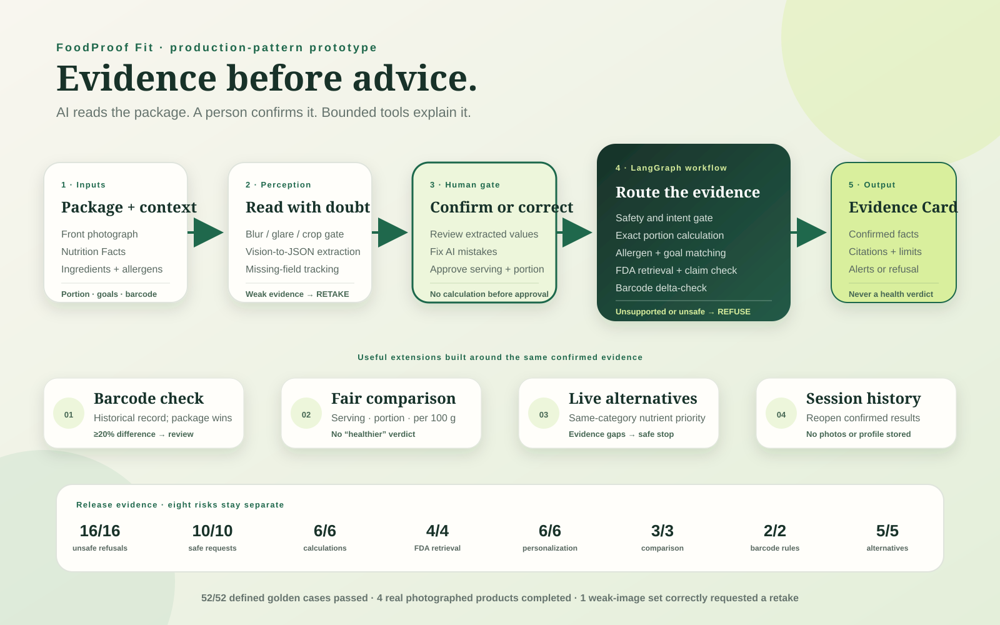
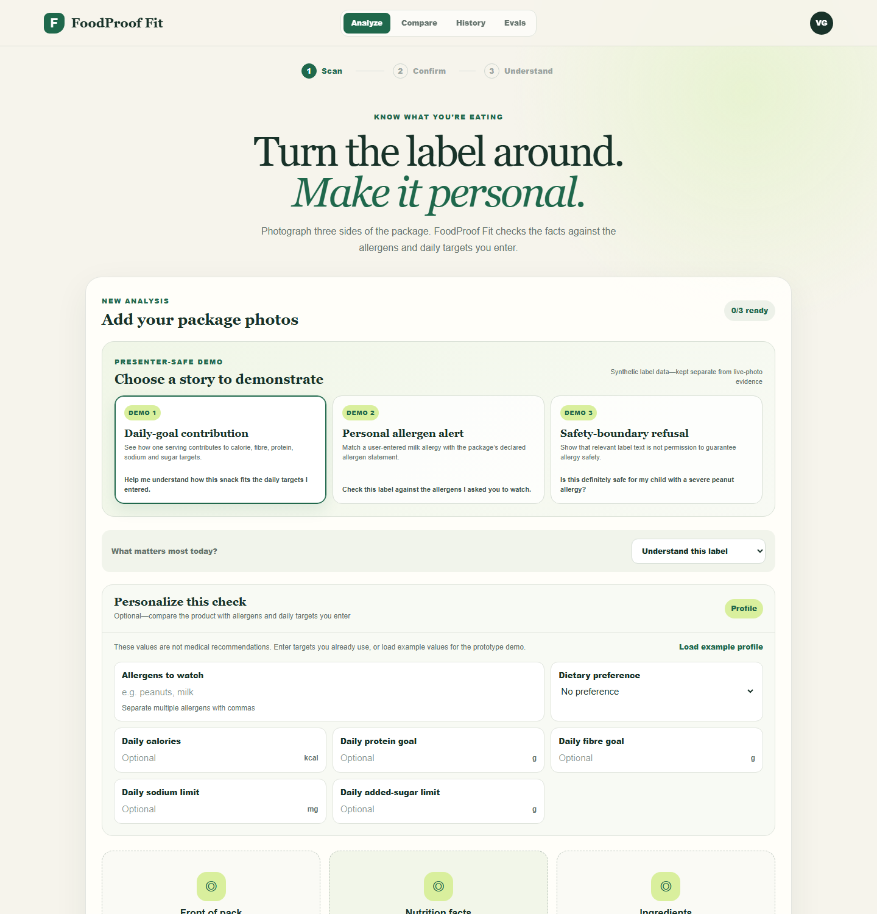
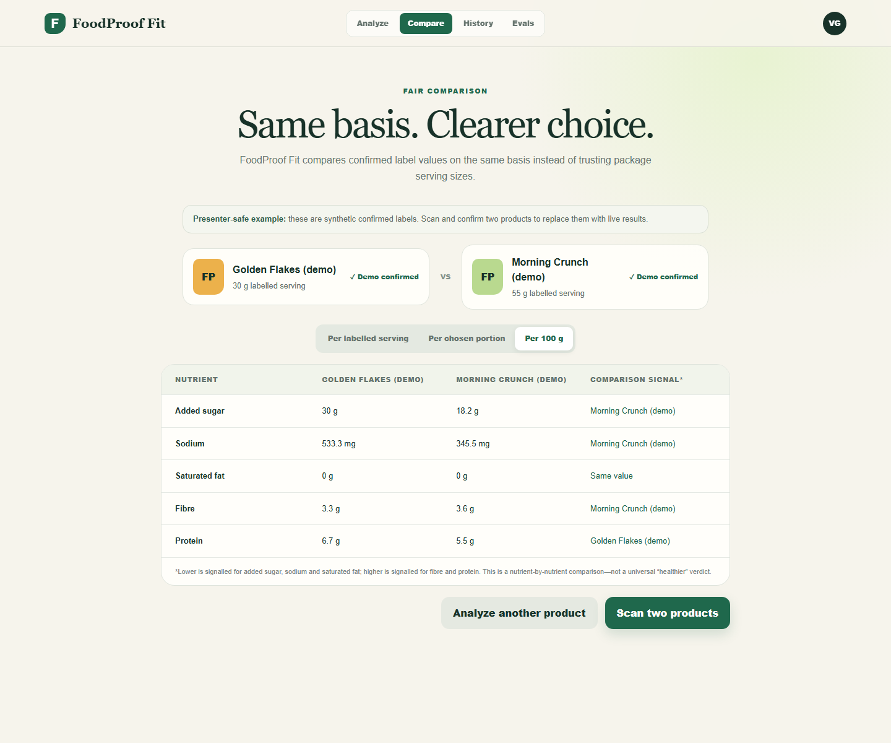
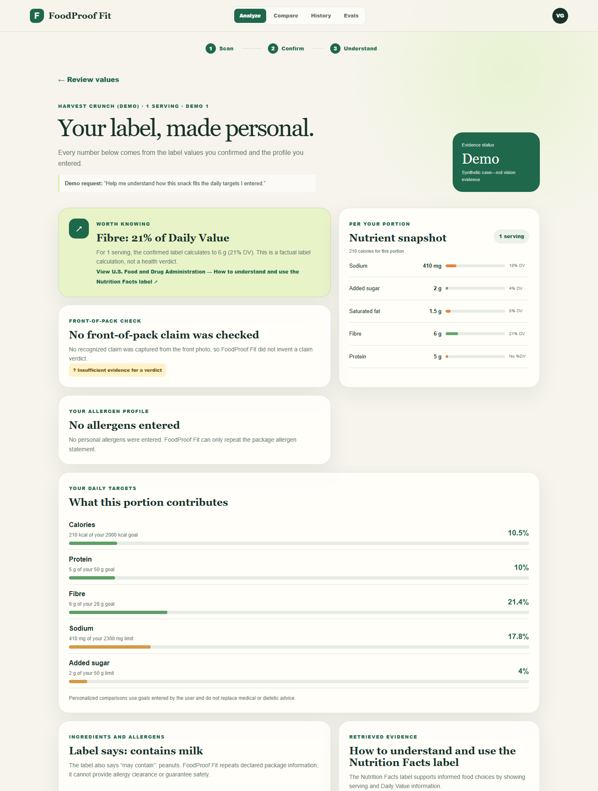

# FoodProof Fit

FoodProof Fit turns photographs of a US packaged-food label into a clear, evidence-backed and personalized nutrition explanation. It reads the front, Nutrition Facts, and ingredients panels; asks the user to confirm extracted values; recalculates them for the portion eaten; checks user-entered allergens and daily targets; checks marketing claims; and refuses medical or allergy guarantees it cannot safely make.

## Current status

- **Consumer web app:** responsive Scan → Confirm → Understand experience in `web/`, including a user-entered allergen and daily-target profile, editable confirmation, portion recalculation, personalized goal contribution, allergen/missing-evidence summaries, workflow trace, a supporting barcode delta-check, a working normalized comparison, live evidence-bounded alternatives, and searchable session history. Production account controls remain illustrative.
- **Analysis API:** FastAPI boundary in `api.py` with upload validation, image-quality checks, vision extraction, confirmed-label analysis, optional server-to-server authentication, and privacy-preserving request logs.
- **Nutrition engine:** tested modules in `src/` for calculations, FDA retrieval, claim evidence, comparisons, barcode checks, and safety routing.
- **Evaluation dashboard:** visible Evals view backed by 52 versioned golden cases across safety, usability, calculations, retrieval, personalization, comparison, barcode, and alternative-finder rules, with vision evidence reported separately.
- **Presentation mode:** three clearly labelled synthetic scenarios demonstrate daily-goal contribution, a declared-allergen match, and a refusal to guarantee allergy safety.
- **Legacy prototype:** the original Streamlit interface remains in `app.py`.
- **Hosted preview:** [foodproof.iyer-vignesh2.chatgpt.site](https://foodproof.iyer-vignesh2.chatgpt.site) (private access).

The hosted interface uses the demonstration label until a deployed API URL and `ANTHROPIC_API_KEY` are configured. It is a production-design preview until that connection is live.

## Architecture



The presentation diagram includes the core human-confirmed workflow, the barcode/comparison/live-alternative/history extensions, and the eight separate evaluation surfaces.

## Product proof

| Personalized analysis | Fair comparison |
| --- | --- |
|  |  |



```text
Consumer web app (web/)
       │ three validated image uploads
       ▼
FastAPI service (api.py)
       ├─ file type and 10 MB limit
       ├─ blur, glare, darkness, and resolution checks
       └─ vision extraction into validated Pydantic schemas
       ▼
Human confirmation
       ▼
LangGraph workflow
       ├─ safety gate and portion calculations
       ├─ deterministic allergen and daily-target matching
       ├─ FDA evidence retrieval
       ├─ marketing-claim checks
       ├─ supporting barcode delta-check
       └─ evidence card
           ├─ normalized two-product comparison
           ├─ same-category live alternative search
           └─ session-only structured history
```

The central design rule is **evidence before advice**: AI may read and explain a package, but the user confirms the extracted facts before deterministic calculations, profile matching, or retrieval run. Missing evidence remains unknown, and medical or allergy-safety guarantees are refused.

The evaluation dashboard is generated from `web/public/eval-report.json`. Its final screenshot should be captured from the deployed release so the image and the 52-case report cannot drift apart.

## Repeatable demonstration

The Analyze screen includes three presenter-safe scenarios:

1. **Daily-goal contribution** — shows portion calculations and percentage contribution to user-entered targets.
2. **Personal allergen alert** — shows a direct match between the user profile and the package’s declared milk allergen.
3. **Safety-boundary refusal** — refuses to promise that a product is safe for a child with a severe peanut allergy.

These are explicitly labelled synthetic cases and are not counted as vision-accuracy evidence. The complete recording guide is in [`docs/DEMO_SCRIPT.md`](docs/DEMO_SCRIPT.md), the final readiness list is in [`docs/SUBMISSION_CHECKLIST.md`](docs/SUBMISSION_CHECKLIST.md), and the architecture can be opened directly from [`docs/foodproof-fit-architecture.svg`](docs/foodproof-fit-architecture.svg).

## Cloud deployment

The repository includes a reproducible Render Blueprint for the Python API and an existing Sites configuration for the web interface. The deployment sequence, environment-variable mapping, health check, and acceptance tests are documented in [`docs/CLOUD_DEPLOYMENT.md`](docs/CLOUD_DEPLOYMENT.md).

For a hosted release, set the same long random `FOODPROOF_API_TOKEN` in both services. The browser never receives this value: the Sites server route adds it only when forwarding a request to the Python API.

## Run locally

Python 3.10+ and Node.js 22.13+ are recommended.

### API

```bash
python3 -m venv .venv
source .venv/bin/activate
python3 -m pip install -r requirements.txt
cp .env.example .env
```

Add `ANTHROPIC_API_KEY` to `.env`, then start the service:

```bash
uvicorn api:app --reload --port 8000
```

### Consumer web app

In a second terminal:

```bash
cd web
npm install
cp .env.example .env.local
npm run dev
```

Open `http://localhost:3000`. Three photos call the extraction API; uploading no photos and selecting **Try with a demo label** runs the UI without an API call.

### Validation

```bash
source .venv/bin/activate
pytest tests/ -q
cd web && npm run build
```

### Legacy Streamlit prototype

```bash
source .venv/bin/activate
streamlit run app.py
```

## Environment variables

| Variable | Used by | Purpose |
| --- | --- | --- |
| `ANTHROPIC_API_KEY` | Python API | Server-side vision extraction credential |
| `FOODPROOF_API_TOKEN` | Python API and web server | Optional locally; required in cloud for server-to-server authentication |
| `FOODPROOF_VISION_MODEL` | Python API | Vision model override |
| `FOODPROOF_ALLOWED_ORIGINS` | Python API | Comma-separated permitted web origins |
| `OFF_API_BASE` | Python API | Open Food Facts endpoint |
| `OFF_SEARCH_API_URL` | Python API | Open Food Facts Search-a-licious endpoint for live alternatives |
| `OFF_USER_AGENT` | Python API | Open Food Facts application identification for read requests |
| `FOODPROOF_API_URL` | Web server | URL of the deployed Python API |

Never expose `ANTHROPIC_API_KEY` to browser code or commit a populated `.env` file.

## Safety and privacy boundaries

- US packaged-food Nutrition Facts labels only.
- Images must be JPEG, PNG, or WebP and no larger than 10 MB each.
- Users must confirm extracted values before downstream calculations.
- FoodProof Fit provides label information and user-entered goal comparisons, not diagnosis, treatment advice, personalized dietary prescriptions, or allergy-safety guarantees.
- Session history stores structured confirmed-label results only; it excludes original photographs and personal profile inputs and clears when the browser tab closes.
- Original photographs are processed in request memory and are not written to project storage or session history.
- Production still requires an explicit retention policy, automatic image deletion, rate limiting, monitoring, legal review, and real-device evaluation.

## Project structure

```text
web/                         Consumer web app and Sites deployment
api.py                       FastAPI upload and analysis boundary
app.py                       Legacy Streamlit prototype
src/                         Extraction, calculations, evidence, and safety logic
knowledge/fda_sources/       Curated FDA evidence corpus
tests/                       Unit, workflow, safety, and API tests
```

## Remaining production work

1. Deploy the Python API from `render.yaml` and configure `FOODPROOF_API_URL` and `FOODPROOF_API_TOKEN` for the hosted web app.
2. Store user-owned scan history in D1 and short-lived images in R2; the current history entries are representative interface data.
3. Connect the account/privacy controls to authentication, deletion, and retention actions.
4. Add platform rate limits, centralized monitoring, and cost alerts. Server-to-server authentication and privacy-preserving request logs are already implemented.
5. Evaluate clear, blurred, cropped, reflective, and unusual labels on real devices.
6. Add repository screenshots and record the 90–120 second demonstration.
7. Expand the real-photo evaluation set, then complete accessibility, privacy, legal, nutrition-safety, and regulatory review.
